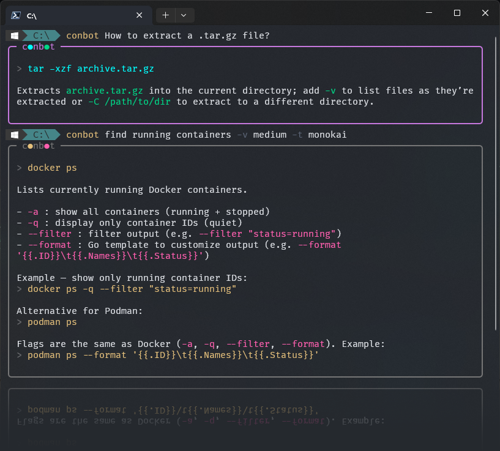
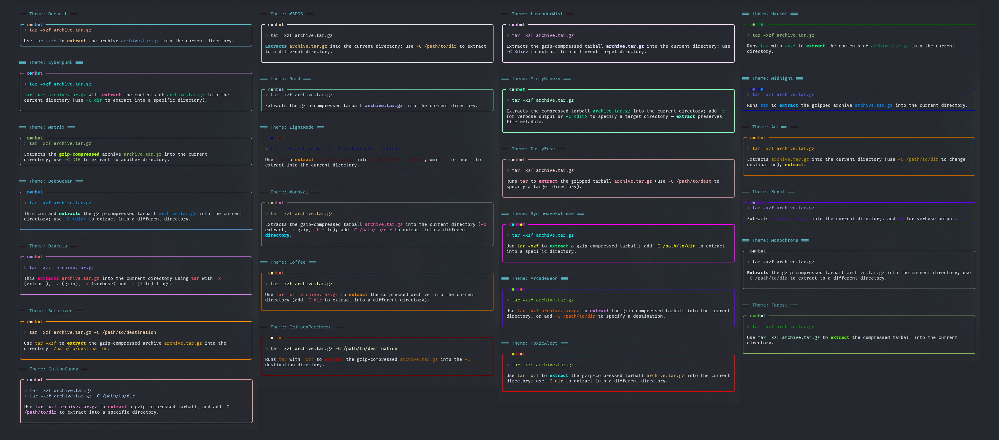

# ConBot

The terminal AI landscape is saturated with complex, stateful agents designed for codebase mutation and multi-step reasoning.

**ConBot is positioned as an anti-agent.** It fills the gap for a low-friction, "search-and-done" reference utility.



<a href="assets/conbotThemes.png">View Theme Overview</a>

## Core Features

* **Simple & Safe:** Single-shot CLI command. It takes no control of your system, executes no actions and instantly hands control back to the host shell.
* **BYOK & Dynamic AI Routing:** Bring Your Own Key. Seamlessly switch between OpenAI, OpenRouter, or local API instances (like Ollama).
* **JSON Configurability:** Fully managed via `appsettings.json` for effortless environment and provider swapping.
* **Dynamic Theming:** Utilizes `Spectre.Console` with a custom parser to dynamically colorize Markdown outputs based on.
* **Robust CLI Parsing:** Leverages `Spectre.Console.Cli` for argument validation, strict typing, and auto-generated help screens.

## Installation

Clone the repository and compile using the .NET CLI. ConBot is deployed as a single, self-contained executable bundle (CoreCLR) without requiring the .NET runtime on the host machine.

```bash
git clone https://github.com/guidokl/ConBot.git
cd ConBot

# For Debian/Linux
dotnet publish -c Release -r linux-x64 --self-contained true /p:PublishSingleFile=true /p:IncludeNativeLibrariesForSelfExtract=true

# For Windows 11
dotnet publish -c Release -r win-x64 --self-contained true /p:PublishSingleFile=true /p:IncludeNativeLibrariesForSelfExtract=true
```

Move the compiled conbot (or conbot.exe) executable to a directory within your system's $PATH or Environment Variables.

## Configuration

ConBot operates on a Bring Your Own Key (BYOK) model. To get started, rename the provided `appsettings.example.json` to `appsettings.json`, and insert your API key and preferred configuration:

```json
{
  "AiSettings": {
    "Provider": "OpenAI",
    "ApiKey": "YOUR_API_KEY_HERE",
    "ModelId": "gpt-5-mini",
    "EndpointUrl": ""
  },
  "PromptSettings": {
    "OsContext": "generic Linux/Windows",
    "Verbosity": "short"
  },
  "AppSettings": {
    "ActiveTheme": "Monokai"
  }
}
```

* **ApiKey:** Your API token. Keep this file excluded from source control.
* **EndpointUrl:** Leave empty to use the default OpenAI REST endpoint. Populate with an alternative URI (e.g., `https://openrouter.ai/api/v1` or a local Ollama instance) to dynamically reroute the provider.
* **ActiveTheme:** Choose one of 25 themes (see below).

## Usage

Pass your query as a string argument directly to the executable.

```bash
conbot How do I extract a .tar.gz file?
```

Output is strictly governed by the system prompt to return only the exact command syntax accompanied by a contextual explanation.

You can dynamically override the configured verbosity setting per invocation utilizing the `-v|--verbosity` flag:

```bash
conbot -v long "find running containers"
```

Use `conbot --help` to view the auto-generated CLI parameter list and execution options.

## Themes

<a href="assets/conbotThemes.png">View Theme Overview (Full Size)</a>

 
* **Selection:** 25 built-in themes with a modular architecture for adding custom skins.
* **Customization:** Easily switch between high-contrast and minimalist styles to suit your terminal environment.
* **appthemes.json:** Accepts standard valid `Spectre.Console` color names to dynamically skin the UI without recompilation.

## Architecture

ConBot is built on C# and .NET 10. It enforces strict Dependency Inversion, isolating the UI presentation layer (`AppEngine`) from the HTTP REST logic (`IAiProvider`).

- `Spectre.Console.Cli`: Handles strict input validation, `Enum` enforcement, and command routing.
- `Microsoft.Extensions.DependencyInjection`: Bootstraps the Composition Root, bridged to Spectre's internal router via a custom `TypeRegistrar` adapter.
- `AppEngine`: Custom state-machine parser intercepting raw LLM output to parse Markdown blocks and flawlessly render structured UI output via `Spectre.Console`.
